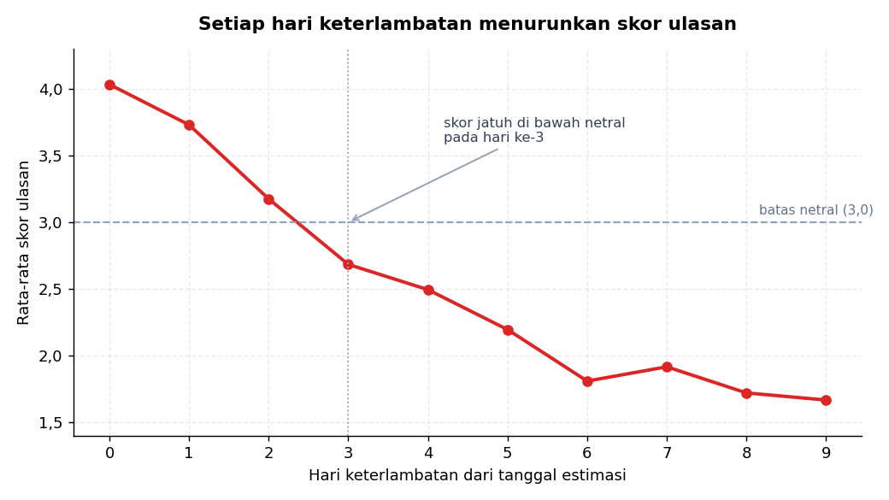
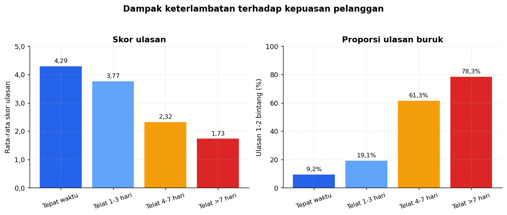
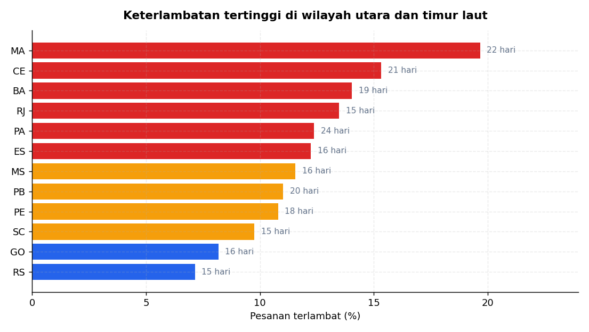
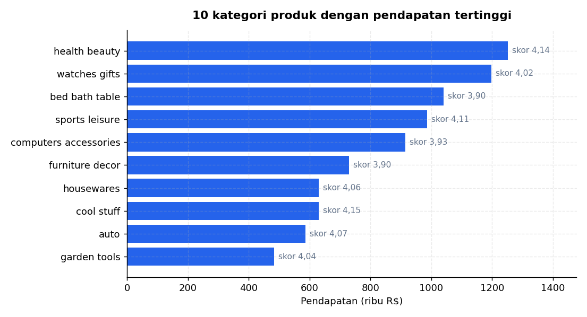
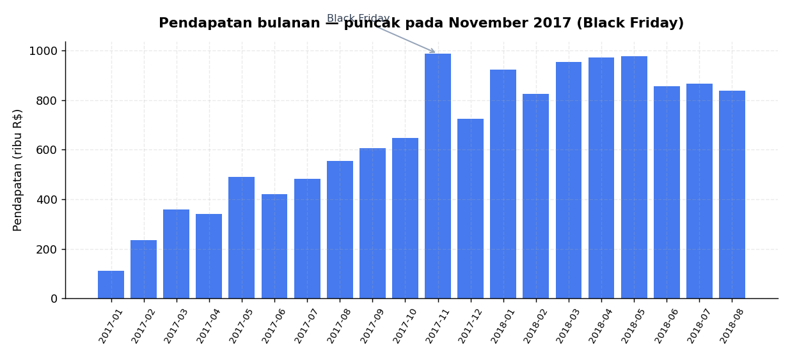

# 📦 Analisis E-Commerce Olist — Dampak Keterlambatan Pengiriman terhadap Kepuasan Pelanggan

Analisis atas **99.441 pesanan** marketplace Olist (Brasil), September 2016 – Oktober 2018,
menggunakan **SQL** untuk agregasi dan **Python** untuk penyajian.

> **Pertanyaan yang dijawab:** seberapa besar keterlambatan pengiriman merusak kepuasan
> pelanggan, dan pada hari keberapa kerusakannya menjadi serius?

📓 **[Buka notebook analisis lengkap →](notebooks/analisis_olist.ipynb)**

---

## 🎯 Temuan Utama

**Skor ulasan turun sekitar 0,35 poin untuk setiap hari keterlambatan, dan menjadi
negatif mulai hari ketiga.**



Toleransi pelanggan ternyata bukan soal terlambat atau tidak, melainkan soal *seberapa
lama*. Keterlambatan satu hari masih menyisakan skor 3,73 — masih positif. Pada hari
ketiga, rata-rata jatuh ke 2,68 dan ulasan berubah menjadi negatif.



| Kategori pengiriman | Pesanan | Rata-rata skor | Ulasan 1–2 bintang |
|---|---:|---:|---:|
| Tepat waktu / lebih cepat | 88.653 | **4,29** | 9,2% |
| Telat 1–3 hari | 2.651 | 3,77 | 19,1% |
| Telat 4–7 hari | 1.777 | 2,32 | 61,3% |
| Telat lebih dari 7 hari | 3.272 | **1,73** | **78,3%** |

---

## 📊 Temuan Pendukung

**8,11% pesanan tiba terlambat**, meskipun estimasi sudah dilebihkan cukup jauh:
pengiriman rata-rata butuh **12,6 hari**, sementara yang dijanjikan **23,7 hari**.
Cadangan waktu 11 hari itu tetap gagal pada 1 dari 12 pesanan — jadi masalahnya
gangguan logistik nyata, bukan sekadar estimasi yang terlalu ketat.



Keterlambatan terpusat di wilayah utara dan timur laut. **Maranhão (MA)** mencatat
19,1% keterlambatan dengan durasi kirim rata-rata 21,4 hari — lebih dari dua kali
lipat wilayah tenggara.



`health_beauty` memimpin pendapatan (R$ 1,25 juta). Skor antar kategori relatif seragam
di kisaran 3,9–4,2, memperkuat dugaan bahwa penentu kepuasan adalah pengalaman
pengiriman, bukan jenis produknya.



Pendapatan tumbuh konsisten sepanjang 2017–2018, dengan puncak pada **November 2017**
(Black Friday). **10% penjual teratas menguasai 67,5% pendapatan** dari total 3.095
penjual — distribusi Pareto yang ekstrem.

---

## 💡 Rekomendasi

**1. Jadikan hari ketiga sebagai ambang eskalasi.**
Kerusakan reputasi terjadi pada rentang sempit yang bisa diprediksi. Pesanan yang lewat
tenggat perlu ditangani sebelum hari ketiga — pemberitahuan proaktif, kompensasi ongkir,
atau percepatan pengiriman. Menunggu ulasan masuk berarti sudah terlambat.

**2. Perlakukan wilayah utara dan timur laut secara terpisah.**
MA, CE, BA, dan PA memerlukan mitra logistik atau gudang penyangga tersendiri. Satu
standar nasional menutupi masalah yang sebenarnya terpusat.

**3. Jangan perpanjang estimasi sebagai solusi.**
Cadangan 11 hari sudah diberikan dan tetap gagal pada 8% pesanan. Menambah cadangan
hanya memperburuk daya saing tanpa menyentuh akar masalah.

**4. Prioritaskan 300 penjual teratas.**
Karena 10% penjual menguasai 67,5% pendapatan, pendampingan yang terfokus pada kelompok
ini memberi dampak terbesar per satuan usaha.

---

## 🗂️ Struktur Proyek

```
analisis-ecommerce-olist/
├── load_data.py                    # 9 berkas CSV → SQLite, termasuk indeks
├── buat_grafik.py                  # Menghasilkan seluruh grafik ke output/
├── notebooks/
│   └── analisis_olist.ipynb        # Analisis lengkap beserta narasinya
├── sql/                            # Query SQL yang berdiri sendiri
│   ├── 01_ikhtisar.sql
│   ├── 02_keterlambatan_vs_ulasan.sql
│   ├── 03_kinerja_wilayah.sql
│   ├── 04_kategori_produk.sql
│   ├── 05_konsentrasi_penjual.sql
│   └── 06_tren_bulanan.sql
├── output/                         # Grafik hasil ekspor
└── data/                           # Dataset CSV (tidak disertakan, lihat di bawah)
```

---

## 🔍 Teknik SQL yang Digunakan

| Berkas | Teknik |
|---|---|
| `02_keterlambatan_vs_ulasan.sql` | CTE, `CASE WHEN` untuk pengelompokan, agregasi bersyarat |
| `03_kinerja_wilayah.sql` | JOIN tiga tabel, `HAVING` untuk menyaring sampel kecil |
| `04_kategori_produk.sql` | `LEFT JOIN` tabel terjemahan, `COALESCE` untuk nilai kosong |
| `05_konsentrasi_penjual.sql` | *Window function*: `ROW_NUMBER()`, `SUM() OVER (ROWS UNBOUNDED PRECEDING)` |
| `06_tren_bulanan.sql` | `LAG()` untuk menghitung pertumbuhan bulan-ke-bulan |

Perhitungan selisih tanggal memakai `julianday()`, dan seluruh agregasi dijalankan di
sisi basis data — pandas hanya menerima hasil akhirnya.

---

## 🚀 Menjalankan Ulang

**1. Unduh dataset**

Ambil dari [Kaggle — Brazilian E-Commerce Public Dataset by Olist](https://www.kaggle.com/datasets/olistbr/brazilian-ecommerce)
(±45 MB), lalu tempatkan kesembilan berkas `.csv` ke dalam folder `data/`.

Berkas CSV tidak disertakan dalam repositori ini karena berukuran 121 MB.

**2. Pasang dependensi**

```bash
pip install -r requirements.txt
```

**3. Muat data ke SQLite**

```bash
python load_data.py
```

**4. Hasilkan grafik**

```bash
python buat_grafik.py
```

Notebook dapat dibuka langsung setelah langkah 3.

---

## 🛠️ Teknologi

`Python 3.12` · `SQLite` · `pandas` · `matplotlib` · `Jupyter`

---

## ⚠️ Batasan

- Data berhenti pada Oktober 2018 dan hanya mencakup pasar Brasil.
- Hubungan yang ditemukan bersifat **korelasional**, bukan sebab-akibat: pesanan yang
  terlambat bisa jadi juga berbeda dalam hal jarak, jenis produk, atau penjual.
- Tanggal estimasi ditentukan oleh sistem Olist, bukan patokan industri.
- Pesanan yang dibatalkan sebelum sampai tidak dianalisis.

---

## 📄 Sumber Data

[Brazilian E-Commerce Public Dataset by Olist](https://www.kaggle.com/datasets/olistbr/brazilian-ecommerce)
— dirilis Olist di Kaggle dengan lisensi CC BY-NC-SA 4.0. Data telah dianonimkan oleh
penyedianya.

---

## 👤 Penulis

**Naufhal Muhammad Dryant** — Universitas Faletehan

---

<sub>Proyek ini dikerjakan dengan bantuan Claude (Anthropic), mencakup penyusunan
kueri SQL, kode Python, dan penulisan narasi temuan.</sub>
